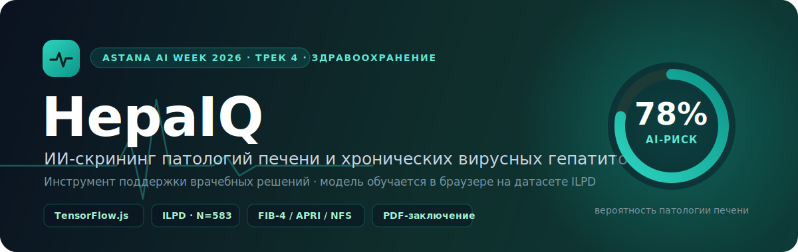

<p align="center">
  
</p>

<p align="center">
  <a href="#-лицензия"></a>
  
  
  
  
  
</p>

<h1 align="center">HepaIQ</h1>
<h3 align="center">ИИ-инструмент врача для раннего выявления патологий печени<br>и хронических вирусных гепатитов</h3>

<p align="center">
  <i>Доклад-презентация проекта · Хакатон Astana AI Week 2026 · Трек «Здравоохранение»</i>
</p>

---

> ## ⚕️ Медицинский дисклеймер
> **HepaIQ — исследовательский прототип, а не сертифицированное медицинское изделие.** Оценка риска **не является диагнозом** и **не заменяет** очный осмотр врача, эластографию (FibroScan) или биопсию печени. Модель обучена на открытом датасете **ILPD (индийская популяция)** и **требует локальной клинической валидации** перед применением. Все вычисления выполняются в браузере; **персональные данные пациентов не собираются, не передаются и не сохраняются.**

---

## 📑 Содержание

1. [Аннотация](#1--аннотация)
2. [Проблема](#2--проблема)
3. [Кому это нужно](#3--кому-это-нужно)
4. [Решение: что такое HepaIQ](#4--решение-что-такое-hepaiq)
5. [Сценарий использования](#5--сценарий-использования-демо)
6. [Архитектура](#6--архитектура)
7. [Как работает ИИ](#7--как-работает-ии)
8. [Клинические шкалы фиброза](#8--клинические-шкалы-фиброза)
9. [Объяснимость и поддержка решений](#9--объяснимость-и-поддержка-решений)
10. [Метрики модели](#10--метрики-модели)
11. [Приватность и безопасность](#11--приватность-и-безопасность)
12. [Технологический стек](#12--технологический-стек)
13. [Соответствие задаче трека](#13--соответствие-задаче-трека)
14. [Ограничения и честная оценка](#14--ограничения-и-честная-оценка)
15. [Дорожная карта](#15--дорожная-карта)
16. [Запуск и проверка проекта](#16--запуск-и-проверка-проекта)
17. [Структура проекта](#17--структура-проекта)
18. [Данные и лицензии](#18--данные-и-лицензии)
19. [Лицензия](#-лицензия)

---

## 1. 📌 Аннотация

**HepaIQ** — это рабочее место врача первичного звена (ПМСП), которое за секунды превращает стандартную биохимическую панель в **объяснимую оценку риска патологии печени** и готовое **PDF-заключение**.

Ключевое отличие от типичных калькуляторов: под капотом не набор правил `if/else`, а **настоящая модель машинного обучения, которая обучается прямо в браузере на реальном датасете ILPD**. При этом весь продукт — это **один HTML-файл без бэкенда**, который открывается на любом компьютере в поликлинике и не отправляет данные пациента в сеть.

> **Одним предложением:** ИИ-триаж патологий печени и ХВГ + валидированные шкалы фиброза + объяснимость + заключение — в одном файле, без сервера, с приватностью по дизайну.

---

## 2. 🎯 Проблема

Патологии печени и хронические вирусные гепатиты **B** и **C** (ХВГ) часто выявляются **поздно** — уже на стадии фиброза, цирроза или осложнений, когда лечение дороже, а прогноз хуже.

**Почему так происходит:**

| Барьер | Следствие |
|---|---|
| 🧩 Данные лабораторий фрагментированы | Нет цельной картины риска пациента |
| 🩺 Врачи ПМСП перегружены | Нет времени вручную считать шкалы и приоритизировать |
| 🚦 Нет инструмента триажа группы риска | Пациенты с реальным риском теряют время в очереди |
| 🏥 Гепатоцентры получают непрофильные случаи | Ресурс специалистов расходуется неэффективно |

> Задача сформулирована в рамках медицинского трека **Astana AI Week 2026** (Министерство здравоохранения РК): *«ИИ и цифровой мониторинг для раннего выявления патологий печени и ХВГ»*.

---

## 3. 👥 Кому это нужно

- **Врач ПМСП / терапевт** — быстрый триаж: кого направить на дообследование первым.
- **Гепатолог** — предварительная стратификация входящего потока.
- **Организатор здравоохранения** — раннее выявление снижает инвалидизацию, смертность и нагрузку на стационар.
- **Пациент** — своевременное выявление = более простое и дешёвое лечение.

---

## 4. 💡 Решение: что такое HepaIQ

HepaIQ объединяет **четыре инструмента** в одном экране:

```
┌─────────────────────────────────────────────────────────────┐
│  1. ML-ОЦЕНКА          2. ШКАЛЫ ФИБРОЗА    3. ОБЪЯСНИМОСТЬ    │
│  вероятность           FIB-4 · APRI · NFS  вклад каждого     │
│  патологии печени      с «серой зоной»     показателя        │
│  (модель на ILPD)                                            │
│                                                              │
│  4. ПОДДЕРЖКА РЕШЕНИЙ → маршрутизация + red-flags → PDF      │
└─────────────────────────────────────────────────────────────┘
```

**Возможности:**

| | Функция | Описание |
|---|---|---|
| 🧠 | **Реальная ML, не rule-based** | Логистическая регрессия обучается в браузере на 583 записях ILPD (TensorFlow.js); резервный обучатель на чистом JS гарантирует работу на любом железе |
| 📊 | **Три клинические шкалы** | FIB-4, APRI, NFS — по опубликованным формулам, с порогами и разметкой «серой зоны» |
| 🔍 | **Объяснимый ИИ** | Диверджентные бары показывают, какие анализы повышают/понижают риск — прозрачность вместо «чёрного ящика» |
| 🚦 | **Клиническая маршрутизация** | Срочная / промежуточная / плановая тактика + автоматические настораживающие признаки |
| 📄 | **PDF-заключение** | Готовый документ с кириллицей для карты пациента + печать и копирование |
| 🔒 | **Приватность по дизайну** | 100% на клиенте, без бэкенда, без сохранения ПДн |
| 🌐 | **Единицы РК** | Переключение билирубина мг/дл ⇄ мкмоль/л, референсные интервалы, подсветка вне-нормы |
| ⚡ | **Ноль установки** | Один `index.html` — открывается в любом браузере |

---

## 5. 🖥 Сценарий использования (демо)

Форма стартует **пустой**; для мгновенной демонстрации есть три готовых клинических примера в один клик.

**Шаг 1.** Врач вводит печёночную панель (или загружает пример: «Вирусный гепатит» / «НАЖБП» / «Норма»).

**Шаг 2.** Система мгновенно, без перезагрузки, показывает:
- **вердикт** с цветовой индикацией риска и конкретной рекомендацией;
- **гейдж вероятности** патологии печени от ML-модели;
- **FIB-4 / APRI / NFS** с интерпретацией зон;
- **вклад показателей** в оценку;
- **настораживающие признаки** (если есть).

**Шаг 3.** Врач нажимает **«Скачать PDF-заключение»** — документ готов к вклейке в карту.

| Пример | Что показывает |
|---|---|
| 🔴 **Вирусный гепатит** | Высокий риск, FIB-4 в красной зоне, red-flags по HBsAg/тромбоцитам, срочная маршрутизация |
| 🟠 **НАЖБП** | Промежуточный риск, «серая зона» шкал, рекомендация дообследования |
| 🟢 **Норма** | Низкий риск, плановое наблюдение |

---

## 6. 🏗 Архитектура

Продукт полностью **клиентский**: нет сервера, базы данных и сетевых запросов с данными пациента.

```
┌──────────────────────────── БРАУЗЕР ВРАЧА ────────────────────────────┐
│                                                                        │
│   Ввод (печёночная панель)                                             │
│            │                                                           │
│            ▼                                                           │
│   Стандартизация признаков (z-score по статистике ILPD)                │
│            │                                                           │
│      ┌─────┴───────────────┬───────────────────────┐                  │
│      ▼                     ▼                       ▼                   │
│  Логистическая        FIB-4 · APRI · NFS      Правила поддержки        │
│  регрессия            (клинические формулы)    решений                 │
│  (обучение in-browser)                        (маршрутизация,          │
│      │                     │                   red-flags)              │
│      ▼                     ▼                       │                   │
│  P(патология) +       интерпретация зон            │                   │
│  вклад признаков                                   │                   │
│      └─────────────┬───────────────────────────────┘                  │
│                    ▼                                                   │
│            Заключение → PDF (jsPDF + шрифт DejaVu, кириллица)          │
│                                                                        │
│   Загрузка библиотек: CDN (TensorFlow.js, jsPDF, Tailwind, Lucide)     │
│   Данные пациента наружу НЕ уходят.                                     │
└────────────────────────────────────────────────────────────────────────┘
```

---

## 7. 🧠 Как работает ИИ

### 7.1. Датасет

**[Indian Liver Patient Dataset (ILPD)](https://archive.ics.uci.edu/dataset/225/ilpd+indian+liver+patient+dataset)** — UCI ML Repository, лицензия CC BY 4.0.

- **583 записи** — 416 пациентов с патологией печени, 167 без.
- **10 признаков:** возраст, пол, билирубин общий и прямой, щелочная фосфатаза, АЛТ, АСТ, общий белок, альбумин, альбумин-глобулиновый коэффициент.
- Встроен прямо в страницу (≈22 КБ); пропуски A/G-коэффициента импутируются средним значением.

### 7.2. Обучение (прямо в браузере)

Модель обучается **при загрузке страницы**, каскадом с гарантией результата:

1. **Приоритет — `TensorFlow.js`** (задействует GPU там, где он есть), с ограничением по времени;
2. **Надёжный резерв** — та же логистическая регрессия, обученная **полнобатчевым градиентным спуском на чистом JavaScript** (≈50 мс, детерминированно, работает на любом железе);
3. **Крайний случай** — предобученные веса.

> Во всех трёх ветках это **настоящая статистическая модель, обученная на данных ILPD**, а не эвристика. Каскад нужен только для того, чтобы приложение никогда не «зависло» и не осталось без модели даже на слабом оборудовании поликлиники.

### 7.3. Инференс

Признаки пациента стандартизируются (z-score по статистике ILPD), затем модель вычисляет вероятность патологии и **вклад каждого признака** в итоговую оценку (для объяснимости). Веса модели клинически осмысленны: **АЛТ, АСТ и билирубин повышают риск, альбумин — понижает.**

---

## 8. 🔬 Клинические шкалы фиброза

Помимо ML-оценки, HepaIQ считает три **валидированные неинвазивные шкалы** по опубликованным формулам:

| Шкала | Формула | Порог «высокого» | Что оценивает |
|---|---|---|---|
| **FIB-4** | `(Возраст × АСТ) / (Тромбоциты × √АЛТ)` | > 2.67 | продвинутый фиброз F3–F4 |
| **APRI** | `(АСТ / ВГН_АСТ × 100) / Тромбоциты` | > 1.5 | значимый фиброз / цирроз |
| **NFS** | линейная комбинация возраста, ИМТ, диабета, АСТ/АЛТ, тромбоцитов, альбумина | > 0.676 | фиброз F3–F4 при НАЖБП |

Каждая шкала размечается на три зоны: **низкий риск** / **серая зона** / **высокий риск**. «Серая зона» — важный клинический сигнал: пациенту показано дообследование (эластография), а не поспешный вывод.

---

## 9. 🔍 Объяснимость и поддержка решений

### 9.1. Объяснимость

Для каждой оценки показываются **диверджентные бары**: какие показатели тянут риск **вверх** (красный) и **вниз** (зелёный), с процентным вкладом. Это делает решение прозрачным для врача — можно проверить, на чём именно основана оценка.

### 9.2. Настораживающие признаки (red-flags)

Система автоматически выделяет клинически значимые паттерны, например:

- **АСТ/АЛТ ≥ 2** — паттерн алкогольного/цирротического поражения;
- **тромбоцитопения** — возможна портальная гипертензия;
- **гипоальбуминемия** — снижение синтетической функции печени;
- **прямая гипербилирубинемия** — холестатический/паренхиматозный компонент;
- **HBsAg (+) / anti-HCV (+)** — показана ПЦР (HBV-DNA / HCV-RNA).

### 9.3. Маршрутизация

На основе ML-оценки, шкал и факторов риска формируется тактика:

| Уровень | Рекомендация |
|---|---|
| 🔴 Высокий | Срочная маршрутизация в гепатоцентр, эластография в течение 2 недель, диспансерный учёт |
| 🟠 Промежуточный / серая зона | Дообследование: эластография, повтор биохимии через 3 мес, ПЦР |
| 🟢 Низкий | Плановое наблюдение ПМСП, коррекция факторов риска, скрининг через 12 мес |

---

## 10. 📈 Метрики модели

Метрики считаются **вживую** на отложенной тестовой выборке (20%) и доступны в модальном окне «ML-модель»:

| Метрика | Значение\* |
|---|---|
| **AUROC** | ≈ 0.75 |
| **Чувствительность** | ≈ 0.94 |
| **Специфичность** | ≈ 0.25 |
| **Точность** | ≈ 0.73 |

> \* ILPD — несбалансированный и объективно «трудный» датасет; цифры **честные** и согласуются с научной литературой. Высокая **чувствительность** выбрана осознанно: для скрининга цена пропуска патологии выше цены ложноположительного результата, который отсеется на дообследовании.

---

## 11. 🔒 Приватность и безопасность

- **100% на клиенте.** Нет сервера и базы данных — обрабатывать нечего и негде утекать.
- **Данные пациента не покидают браузер.** После загрузки страницы расчёты идут офлайн.
- **ПДн не сохраняются** — ни в localStorage, ни куда-либо ещё.
- Единственные сетевые запросы — загрузка библиотек с CDN при старте (без данных пациента).

---

## 12. 🛠 Технологический стек

| Слой | Технология |
|---|---|
| **Интерфейс** | HTML + [Tailwind CSS](https://tailwindcss.com/) + [Lucide Icons](https://lucide.dev/) |
| **ML** | [TensorFlow.js](https://www.tensorflow.org/js) + резервный обучатель на чистом JS |
| **PDF** | [jsPDF](https://github.com/parallax/jsPDF) + шрифт DejaVu Sans (кириллица), фолбэк на печать |
| **Данные** | ILPD (UCI, CC BY 4.0), встроены в страницу |
| **Бэкенд** | отсутствует — всё на клиенте |

Принципы: *минимум зависимостей, ноль установки, приватность по умолчанию.*

---

## 13. ✅ Соответствие задаче трека

Задача трека — комплексное решение для раннего выявления и мониторинга патологий печени и ХВГ. Отражаем **честно**, что реализовано в прототипе, а что — в дорожной карте:

| Требование трека | Статус | Реализация |
|---|---|---|
| Раннее выявление патологий печени и ХВГ | ✅ Реализовано | ML-оценка + шкалы фиброза + red-flags |
| ИИ-триаж | ✅ Реализовано | Стратификация риска по вводимым анализам |
| Поддержка принятия врачебных решений | ✅ Реализовано | Маршрутизация, объяснимость, заключение |
| Сквозной цифровой мониторинг группы риска | 🔜 Дорожная карта | Регистр пациентов + динамика показателей |
| Телемедицина «Врач–Врач» | 🔜 Дорожная карта | Маршрут ПМСП → гепатоцентр |
| Предиктивные данные для планирования | 🔜 Дорожная карта | Агрегированная аналитика |

---

## 14. ⚠️ Ограничения и честная оценка

Мы намеренно не преувеличиваем возможности прототипа:

- **Популяция.** ILPD собран в Индии; пороги (в т.ч. билирубин в мг/дл) валидированы преимущественно на гепатите C. Для РК нужна **локальная калибровка** на анонимизированных данных.
- **Не диагноз.** Инструмент — поддержка решений, а не замена биопсии/эластографии.
- **Специфичность.** Осознанно ниже чувствительности — часть ложноположительных отсеется на дообследовании (приемлемо для скрининга).
- **Прототип.** Не сертифицированное медицинское изделие.

---

## 15. 🗺 Дорожная карта

- [ ] Экспорт модели в **ONNX** + инференс через `onnxruntime-web`
- [ ] Калибровка порогов и дообучение на анонимизированных данных РК
- [ ] Интеграция с **ЕИСЗ / FHIR** (автоподстановка анализов из КМИС)
- [ ] Цифровой регистр группы риска + мониторинг динамики
- [ ] Модуль приглашения на скрининг (SMS / мобильное приложение)
- [ ] Телеконсультация «Врач–Врач» с гепатоцентром
- [ ] Казахская локализация интерфейса

---

## 16. 🚀 Запуск и проверка проекта

Проект — это **один самодостаточный `index.html`**. Ни сборки, ни установки зависимостей, ни бэкенда не требуется.

### 16.1. Требования

- Любой современный браузер (Chrome, Edge, Firefox, Safari).
- **Интернет при первой загрузке** — для получения библиотек с CDN (TensorFlow.js, jsPDF, Tailwind, Lucide). После загрузки все расчёты идут офлайн.
- *(Необязательно)* Python 3 — для запуска локального сервера (рекомендуемый способ).

### 16.2. Способы запуска

**Способ А — двойной клик (самый быстрый).**
Скачайте проект (**Code → Download ZIP**), распакуйте и откройте `index.html` двойным кликом в браузере.

**Способ Б — локальный сервер (рекомендуется).**
Так корректнее грузятся шрифты и библиотеки CDN. В папке проекта выполните:

```bash
python -m http.server 5177
# откройте в браузере: http://localhost:5177
```

> Альтернатива без Python: `npx serve` (Node.js) или расширение **Live Server** в VS Code.

### 16.3. Чек-лист проверки (для жюри) ✅

Пройдите по пунктам — каждый занимает несколько секунд:

| # | Действие | Ожидаемый результат |
|---|---|---|
| 1 | Открыть страницу | Через 1–2 сек в шапке справа загорается **зелёный** индикатор `Модель ILPD · AUC 0.7x` — модель обучилась в браузере |
| 2 | Посмотреть на форму | Поля **пустые**, кнопки-примеры внизу **подсвечены и пульсируют**, справа — приглашение «Введите данные пациента» |
| 3 | Нажать **«Вирусный гепатит»** | Форма заполняется; справа появляются: вердикт «Высокий риск», гейдж вероятности, FIB-4/APRI/NFS, вклад показателей, red-flags |
| 4 | Нажать **«Норма»** | Риск становится «низкий», рекомендация — плановое наблюдение (проверка, что модель реагирует на данные) |
| 5 | Кликнуть индикатор модели в шапке | Открывается окно с метриками (AUROC, чувствительность, специфичность) и **весами признаков** |
| 6 | Переключить единицы билирубина (`мг/дл ⇄`) | Значения пересчитываются в мкмоль/л, итоговая оценка **не меняется** (проверка корректности конвертации) |
| 7 | Нажать **«Скачать PDF-заключение»** | Скачивается PDF-файл `HepaIQ_*.pdf` с **корректной кириллицей** |
| 8 | Нажать **«Печать»** / **«Копировать»** | Открывается диалог печати / текст заключения копируется в буфер |
| 9 | Открыть DevTools → Console | **Нет ошибок** (допустимо только предупреждение Tailwind CDN — оно безвредно) |
| 10 | DevTools → Network | Запросы идут только к CDN при старте; **данные пациента наружу не отправляются** |

### 16.4. Проверка «реальности» ML-модели

Чтобы убедиться, что это **настоящая модель на ILPD**, а не заглушка, откройте консоль браузера (F12) и выполните:

```js
MODEL.engine          // как обучена модель (TensorFlow.js / чистый JS)
MODEL.metrics         // живые метрики на тестовой выборке (auc, sens, spec, acc)
MODEL.w               // веса 10 признаков ILPD
ILPD.length           // 583 — размер встроенного датасета
predict()             // текущая оценка: вероятность + вклад признаков
```

### 16.5. Возможные проблемы

| Симптом | Причина и решение |
|---|---|
| Индикатор модели долго «жёлтый» | Медленный CDN/железо — сработает резервный обучатель на чистом JS (≈50 мс), дождитесь зелёного статуса |
| PDF с «квадратами» вместо кириллицы | Не загрузился шрифт (нет интернета) — воспользуйтесь кнопкой **«Печать» → «Сохранить как PDF»** |
| Пустой экран | Откройте через локальный сервер (способ Б), а не по `file://` — часть браузеров ограничивает CDN на `file://` |

---

## 17. 📂 Структура проекта

```
.
├── index.html        # всё приложение (UI + ML + PDF + встроенный датасет ILPD)
├── docs/
│   └── banner.svg    # баннер репозитория
├── README.md         # этот документ
└── LICENSE           # MIT + уведомления по данным и мед. применению
```

---

## 18. ⚖️ Данные и лицензии

- **Код** — лицензия **MIT** (см. [`LICENSE`](LICENSE)).
- **ILPD** — UCI ML Repository, **CC BY 4.0**. Источник: *Ramana, B.V. & Venkateswarlu, N.B. — ILPD (Indian Liver Patient Dataset), UCI Machine Learning Repository.* <https://archive.ics.uci.edu/dataset/225/ilpd+indian+liver+patient+dataset>
- **Реальные ПДн не используются** — только синтетические примеры и открытый датасет.

---

## 📜 Лицензия

[MIT](LICENSE) © 2026 HepaIQ Team. Датасет ILPD — CC BY 4.0, UCI ML Repository.

<p align="center"><sub>Создано на Astana AI Week 2026 · Alem.ai, Астана · Не является медицинским изделием.</sub></p>
