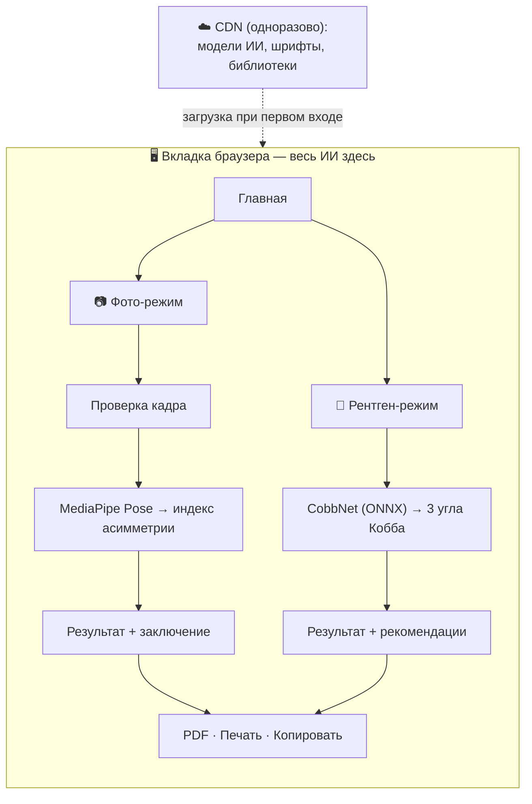
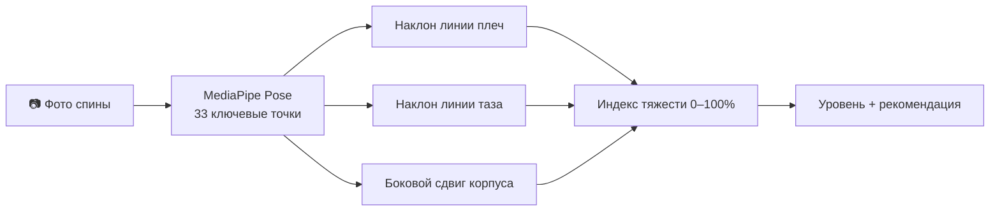
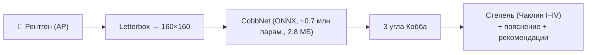
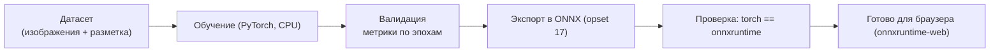

<div align="center">

# 🩺 skaleoz

### Бесплатный скрининг сколиоза и осанки, который работает прямо в браузере

**Наведите камеру на спину — получите мгновенную оценку асимметрии. Ни один пиксель и ни одна нейросеть не покидают ваше устройство.**

<br/>


</div>

---

> [!WARNING]
> ## ⚠️ Важно прочитать первым
> **skaleoz — это инструмент скрининга и просвещения, а НЕ медицинское изделие и НЕ диагноз.**
>
> У проекта нет и не заявляется никаких регуляторных допусков (FDA / CE / Росздравнадзор). Фото никогда не заменит рентген, а ни один результат здесь не должен служить основанием, чтобы начать, изменить или отменить лечение. При любых сомнениях — очная консультация ортопеда. Нейросети в этом репозитории **экспериментальные** и частично обучены на **синтетических** данных (см. раздел [«Честные ограничения»](#13-честные-ограничения)).

---

## 📋 Содержание

1. [Проблема и актуальность](#1-проблема-и-актуальность)
2. [Идея и решение](#2-идея-и-решение)
3. [Что умеет приложение](#3-что-умеет-приложение)
4. [Архитектура: как это работает](#4-архитектура-как-это-работает)
5. [Модуль А — проверка качества кадра](#5-модуль-а--проверка-качества-кадра)
6. [Модуль Б — анализ осанки по фото](#6-модуль-б--анализ-осанки-по-фото)
7. [Модуль В — рентген-режим](#7-модуль-в--рентген-режим)
8. [ML-пайплайн: обучение и экспорт](#8-ml-пайплайн-обучение-и-экспорт)
9. [Данные](#9-данные)
10. [Приватность и этика](#10-приватность-и-этика)
11. [Технологический стек](#11-технологический-стек)
12. [Результаты и метрики](#12-результаты-и-метрики)
13. [Честные ограничения](#13-честные-ограничения)
14. [Дорожная карта](#14-дорожная-карта)
15. [Запуск и обучение своей модели](#15-запуск-и-обучение-своей-модели)
16. [Лицензия и благодарности](#16-лицензия-и-благодарности)

---

## 1. Проблема и актуальность

> **Тезис слайда:** сколиоз массов, часто выявляется поздно, а доступ к скринингу неравномерен.

- **Подростковый идиопатический сколиоз** встречается примерно у **2–3% детей**. Это одно из самых распространённых ортопедических отклонений школьного возраста.
- Ключевая проблема — **позднее выявление**. Дуга нередко замечается, когда искривление уже выражено и консервативные меры менее эффективны.
- Вовремя проведённый скрининг **меняет исход**, но его доступность зависит от школьных программ, наличия клиник и географии.
- Первый шаг («стоит ли показаться врачу?») часто не делается из-за трения: нужно записаться, приехать, раздеться перед незнакомым человеком.

**skaleoz** пытается снять именно это трение первого шага — сделать «нулевую» проверку осанки простой, приватной и честной.

---

## 2. Идея и решение

> **Тезис слайда:** одна веб-страница, весь ИИ — на устройстве, максимум честности.

| Принцип | Как реализовано |
|---|---|
| **Доступность** | Одна веб-страница. Работает на любом телефоне и ноутбуке. Без установки, без аккаунта, без сборки. |
| **Приватность** | Изображение и нейросети остаются на устройстве. Нечего стесняться — фото спины никуда не уходит. |
| **Честность** | Приложение так же громко сообщает, чего оно **не может**, как и то, что может. |
| **Открытость** | Полностью open-source: врач, исследователь, студент или журналист может проверить, как именно всё устроено. |

---

## 3. Что умеет приложение

> **Тезис слайда:** два независимых режима под разные входные данные.

| | 📷 Скрининг по фото | 🩻 Режим рентгена |
|---|---|---|
| **Вход** | Фото спины с телефона | Прямой снимок позвоночника (AP-проекция) |
| **Движок** | MediaPipe Pose (на устройстве) | Обученная модель CobbNet, ONNX (на устройстве) |
| **Выход** | Индекс асимметрии осанки + наклон плеч / таза / боковой сдвиг | Три угла Кобба + степень (по Чаклину I–IV) |
| **Дополнительно** | Автопроверка качества кадра, разметка точек на фото | Углы по сегментам, пояснение простым языком, общие рекомендации по тактике |
| **Честная пометка** | *«прокси-скрининг, не угол Кобба»* | *«эксперимент, обучено на синтетике, не заключение рентгенолога»* |

На каждом экране результата доступны **📄 Скачать PDF-заключение · 🖨️ Печать · 📋 Копировать** — чтобы родитель, учитель или врач мог сохранить или передать результат.

---

## 4. Архитектура: как это работает

> **Тезис слайда:** бэкенда нет. Всё вычисление — в вкладке браузера.



Единственный сетевой трафик — **одноразовая** загрузка файлов моделей, шрифтов и библиотек с публичных CDN. После этого приложение работает автономно; изображения обрабатываются локально через `createImageBitmap`, WebAssembly и WebGL.

Весь фронтенд — **один файл `index.html` (~69 КБ)**: без сборщика, без `node_modules`, без фреймворка.

---

## 5. Модуль А — проверка качества кадра

> **Тезис слайда:** мусор на входе → мусор на выходе. Поэтому фильтруем ДО анализа.

Прежде чем запускать анализ, лёгкий гейт проверяет пригодность снимка и **мягко** ведёт пользователя:

- **Резкость** — дисперсия Лапласиана: размытые кадры отсекаются.
- **Наличие и видимость человека** — по ключевым точкам позы (плечи, таз).
- **Кадрирование** — человек в кадре, не обрезан, не у самого края.

Логика намеренно **щадящая**: жёстко блокируются только явно негодные кадры (нет человека, несколько людей, сильное размытие). Наклон камеры, частичный кадр или мягкий свет дают **предупреждение**, а не отказ — и учитываются в оценке, а не молча искажают её.

---

## 6. Модуль Б — анализ осанки по фото

> **Тезис слайда:** от ключевых точек тела к прокси-индексу асимметрии.



1. **Оценка позы** — Google `pose_landmarker_heavy` (через MediaPipe Tasks Vision) находит плечи, таз, корпус.
2. **Метрики** — наклон линии плеч, наклон таза и боковой сдвиг корпуса.
3. **Индекс тяжести (0–100%)** — комбинация метрик, откалиброванная **выше шумового пола** обычных фото: слегка наклонённая камера или естественная асимметрия позы не «кричат» о сколиозе.

> **Важная честность:** по фронтальному фото со спины нельзя измерить настоящий угол Кобба. Это оценка **поверхностной асимметрии осанки** (аналог сколиометра / теста наклона), а не рентгеновский золотой стандарт.

Рядом работает вторая, **экспериментальная** модель (`model.onnx`, ~0.2 млн параметров, обучена на рисованной синтетике) — она в интерфейсе явно помечена как «не имеет клинического смысла» и служит демонстрацией работоспособности связки браузер → ONNX.

---

## 7. Модуль В — рентген-режим

> **Тезис слайда:** реальная постановка задачи — регрессия углов Кобба по снимку.



Компактная свёрточная сеть **CobbNet** регрессирует три угла Кобба (верхнегрудной, грудной, пояснично-грудной — как в разметке AASCE / Spinal-AI2024), затем по наибольшему углу определяется степень и подбирается сопоставимая справочная тактика.

**Классификация по Чаклину и подходы (справочно):**

| Степень | Угол Кобба | Что обычно значит | Типовая тактика (определяет врач) |
|---|---|---|---|
| I | 1–10° | начальное отклонение | наблюдение, ЛФК, контроль осанки |
| II | 11–25° | лёгкое искривление | наблюдение + рентген-контроль, ЛФК, корсет при росте дуги |
| III | 26–50° | умеренно-выраженное | ортопед обязателен, корсетотерапия, метод Шрот |
| IV | > 50° | тяжёлое | консультация хирурга, рассмотрение операции |

> Рекомендации в приложении сопровождаются оговоркой: это **общая справочная информация**, а не назначение; тактику определяет врач с учётом возраста, зрелости скелета и динамики дуги.

---

## 8. ML-пайплайн: обучение и экспорт

> **Тезис слайда:** полный, воспроизводимый путь данные → обучение → ONNX → браузер.

Папка `train/` содержит PyTorch-скрипты, которыми получены поставляемые ONNX-модели:



- `train/train_xray_cobb.py` — рентген-модель (регрессия 3 углов Кобба).
- `train/train_scoliosis.py` — фото-эксперимент (степень + угол) со встроенным генератором синтетики.

Каждый скрипт обучается на CPU, печатает метрики по эпохам и пишет готовый к браузеру `*.onnx`. Замена весов в приложении — это **замена одного файла**.

---

## 9. Данные

> **Тезис слайда:** используем открытый датасет — честно и с оговорками.

| Модель | Размер | Задача | Обучена на |
|---|---|---|---|
| `pose_landmarker_heavy` | ~30 МБ (CDN) | Ключевые точки тела | Google, MediaPipe |
| `model_xray.onnx` (CobbNet) | 2.8 МБ | 3 угла Кобба по рентгену | 900 снимков [Spinal-AI2024](https://github.com/Ernestchenchen/Spinal-AI2024) |
| `model.onnx` (эксперимент) | 0.8 МБ | Степень + угол по фото | Встроенный **синтетический** генератор |

**Spinal-AI2024** — открыто опубликованный датасет **синтетически сгенерированных** (но откалиброванных под реальные) рентгенов позвоночника из статьи [CurvNet](https://arxiv.org/abs/2411.12604). Мы используем подмножество исключительно для демонстрации рабочего и честного пайплайна.

---

## 10. Приватность и этика

> [!IMPORTANT]
> ### Ни сервера. Ни аккаунта. Ни хранения. Ни телеметрии.
> Фото и рентгены обрабатываются полностью на устройстве. Результаты **нигде не сохраняются** — закрытие вкладки стирает всё. Единственный сетевой запрос — одноразовая загрузка моделей и шрифтов с публичных CDN.

Это не маркетинговая фраза, а **структурное свойство** архитектуры: в проекте [нет бэкенд-кода](server.mjs) кроме 20-строчного статического сервера для локальной разработки.

Этическая позиция проекта: медицинская тема требует сдержанности. Мы намеренно **недо-обещаем** и подчёркиваем экспериментальный статус моделей, чтобы результат нельзя было принять за диагноз.

---

## 11. Технологический стек

> **Тезис слайда:** минимализм — весь фронт в одном файле, ноль сборки.

- **Фронтенд:** ванильный JavaScript, один рукописный `index.html`, собственная CSS-дизайн-система (Plus Jakarta Sans + IBM Plex Mono), иконки [Lucide](https://lucide.dev) — всё через CDN, без шага сборки.
- **ИИ на устройстве:** [MediaPipe Tasks Vision](https://developers.google.com/mediapipe) (поза), [ONNX Runtime Web](https://onnxruntime.ai/docs/tutorials/web/) (модель Кобба), WebAssembly + WebGL.
- **Заключения:** [jsPDF](https://github.com/parallax/jsPDF) + [html2canvas](https://html2canvas.hertzen.com) (кириллица-безопасно, растеризацией).
- **Обучение:** PyTorch → ONNX (opset 17), проверка через ONNX Runtime.
- **Локальный сервер:** 20 строк Node.js (`server.mjs`).

---

## 12. Результаты и метрики

> **Тезис слайда:** цифры честные, с указанием, на чём измерялись.

| Показатель | Значение | На чём измерено |
|---|---|---|
| Средняя ошибка углов Кобба (CobbNet) | **≈ 5.5°** MAE | отложенная **синтетическая** выборка Spinal-AI2024 |
| Размер рентген-модели | **2.8 МБ** | ONNX, ~0.7 млн параметров |
| Размер фронтенда | **~69 КБ** | один `index.html`, без сборки |
| Хранение данных | **0 байт** | ничего не пишется в браузер |
| Задержка инференса | секунды | локально, WASM/WebGL |

Для сравнения: типичная межэкспертная вариабельность измерения угла Кобба в клинике — порядка 3–5°. Достигнутая ошибка **сопоставима по порядку**, но получена на синтетике — см. следующий раздел.

---

## 13. Честные ограничения

> **Тезис слайда:** лучше недо-обещать. Прочитайте это перед тем, как цитировать любую цифру.

- **По фото нельзя измерить настоящий угол Кобба.** Фото-режим оценивает *поверхностную асимметрию осанки*, а не рентгеновский стандарт.
- **Рентген-модель экспериментальная.** Обучена на **900 синтетических** снимках, ошибка ≈5.5° получена **на синтетической** выборке. Это доказывает работоспособность пайплайна, но **не** устанавливает клиническую точность на реальных пациентах.
- **`model.onnx` (фото-ИИ) — демонстрация связки**, обучена на рисованной синтетике; её числа в приложении помечены как «без клинического смысла».
- **Не валидировано, не сертифицировано, не медизделие.** Нет проспективного исследования, нет регуляторного допуска.
- **Отрицательный результат — не гарантия.** Если что-то выглядит или ощущается не так — к врачу, независимо от показаний приложения.

Реальную клиническую ценность даст только корректно собранный, размеченный датасет с согласием пациентов и проспективная валидация — честное и неромантичное «узкое место» любого медицинского ИИ.

---

## 14. Дорожная карта

- [ ] Модель ключевых точек **позвоночника** (позвонки → кривая) вместо прокси по плечам/тазу
- [ ] **Тест Адамса** (наклон вперёд, второй ракурс) для выявления рёберного горба
- [ ] Обучение на **реальном** датасете рентгенов с согласием
- [ ] **PWA** / офлайн-установка
- [ ] Мультиязычный интерфейс
- [ ] Доступность (скринридеры, контраст)

---

## 15. Запуск и обучение своей модели

> **Тезис слайда:** проверить проект можно за 3 минуты — ниже пошагово, что нажать и что должно произойти.

### 15.1. Требования

| Что | Зачем | Обязательно? |
|---|---|---|
| [Node.js](https://nodejs.org) (v18+) | отдать статический файл локально | да (или любой другой статический сервер) |
| Современный браузер (Chrome / Edge / Safari / Firefox) | запуск on-device ИИ (WebAssembly/WebGL) | да |
| Интернет **при первом входе** | одноразовая загрузка моделей и шрифтов с CDN, потом кэш | да, один раз |

### 15.2. Запуск за 2 шага

Из папки проекта:

```bash
# 1) поднять локальный сервер (server.mjs — 20 строк, без зависимостей)
node server.mjs        # → serving on http://localhost:5173

# 2) открыть в браузере
#    http://localhost:5173
```

> Открытие через `file://` **не сработает** — ES-модули и локальные файлы моделей требуют HTTP-источник. Подойдёт любой статический сервер: `python -m http.server 5173`, `npx serve -l 5173`, nginx и т. п.

### 15.3. Проверка работоспособности (чек-лист)

Пройдите оба сценария — так вы убедитесь, что обе нейросети действительно считают локально.

**А. Скрининг по фото**
1. На главной нажмите **«Начать анализ»** → **«Я готов — перейти к фото»**.
2. Загрузите фото спины (или сделайте снимок камерой). Подойдёт любой снимок человека со спины в полный рост на светлом фоне.
3. *Ожидаемо:* экран «Анализируем…», затем **результат** — вердикт (например, «Явной асимметрии не видно»), **тяжесть в %**, разметка точек поверх фото, таблица измерений.
4. Проверьте гейт качества: загрузите **размытое** или пустое фото → приложение должно **отклонить** кадр с понятной причиной, а не выдать случайный результат.

**Б. Режим рентгена**
1. На главной нажмите карточку **«У меня есть рентген»** (или кнопку на шаге 2/2).
2. Загрузите AP-снимок позвоночника.
3. *Ожидаемо:* «Измеряем углы Кобба…», затем **степень** (I–IV), **основной угол**, сам снимок, углы по сегментам, пояснение и рекомендации.

**В. Заключение**
- На любом результате нажмите **📄 Скачать PDF** (скачается `skaleoz-zakluchenie.pdf`), **🖨️ Печать**, **📋 Копировать** (в буфер ляжет текстовое заключение).

**Г. Проверка приватности (главное обещание проекта)**
- Откройте **DevTools → вкладка Network**, обновите страницу и проведите анализ.
- *Ожидаемо:* исходящих запросов с вашим изображением **нет**. Единственный трафик — загрузка моделей/шрифтов/библиотек с CDN (`jsdelivr`, `googleapis`, `unpkg`, `storage.googleapis.com`). Фото никуда не отправляется.

### 15.4. Где взять тестовые изображения

- **Фото спины:** подойдёт любой снимок человека со спины в полный рост (например, анатомические референс-фото с открытых источников).
- **Рентген:** возьмите любой снимок из открытого датасета [Spinal-AI2024](https://github.com/Ernestchenchen/Spinal-AI2024) — например, файл из папки `Spinal-AI2024-subset5`. Это те же данные, на которых обучалась модель.

### 15.5. Возможные проблемы

| Симптом | Причина | Решение |
|---|---|---|
| Белый экран / «Загрузка ИИ-модели…» навсегда | нет интернета при первом входе | подключите сеть и обновите — модели закэшируются |
| Открыли `index.html` двойным кликом — не работает | это `file://`, а нужен HTTP | запустите `node server.mjs` и откройте `localhost:5173` |
| PDF не скачивается | заблокированы CDN html2canvas/jsPDF | проверьте сеть; появится тост об ошибке |
| «Человек не распознан» на нормальном фото | спина не видна / сильная обрезка / темно | снимите со спины в полный рост при ровном свете |

### 15.6. Обучение своей модели

```bash
pip install torch onnx onnxruntime numpy pillow opencv-python

# Рентген-модель углов Кобба (реальный формат задачи, данные Spinal-AI2024)
python train/train_xray_cobb.py --epochs 22

# Фото-эксперимент «степень + угол» (генератор синтетики встроен)
python train/train_scoliosis.py --epochs 18
```

Скрипт печатает метрики по эпохам и пишет готовый к браузеру `*.onnx`. Положите свои размеченные данные в загрузчик — та же команда обучит модель под них, а замена в приложении сведётся к подмене одного `*.onnx`.

---

## 16. Лицензия и благодарности

**Лицензия.** Код приложения — под **MIT** (см. [`LICENSE`](LICENSE)). Сторонние модели и датасеты сохраняют **свои** условия: MediaPipe (Apache-2.0, Google), ONNX Runtime (MIT), датасет Spinal-AI2024 (в условиях авторов). Проверьте их перед распространением или коммерческим использованием.

**Благодарности.**
- **Google MediaPipe** — оценка позы на устройстве
- **Spinal-AI2024 / CurvNet** ([Chen et al.](https://arxiv.org/abs/2411.12604)) — открытый датасет рентгенов
- **ONNX Runtime Web**, **jsPDF**, **html2canvas**, **Lucide** — плечи open-source, на которых всё стоит

---

<div align="center">

## Сделано с заботой — и с дисклеймерами. 🩺

**Если сомневаетесь — идите к врачу, а не к веб-странице.**

</div>
